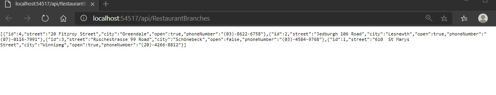
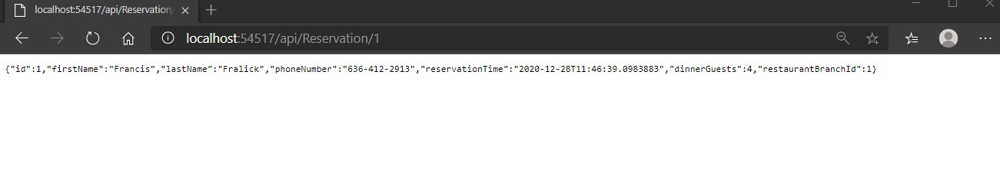

# Module 13: Implementing Web APIs

## Lab: Implementing Web APIs

1. **Nombres y apellidos:** Francisco Javier Moreno Quevedo
2. **Fecha:** 28/12/2020
3. **Resumen del Ejercicio:** implementarla web Api y sus respectivas llamadas desde Jquery o desde Httpclient en el proyecto 1/3
4. **Dificultad o problemas presentados y como se resolvieron:** Ninguna

Ejercicio 1: Adding Actions and Calling them by using Microsoft Edge

- AÑadimos las dependencias a la solucion

- Del lado del servidor creamos un controlador **RestaurantBranchesController**

  - Añadimos su constructor y la accion get

- Ejecutamos y comprobamos que nos salen la lista de Branches en formato json

  

- Añadimos del lado del servidor el controlador **ReservationController**
  - Añadimos su constructor y la accion GetById
- Ejecutamos con API/Reservation/1 y comprobamos que devuelve

- Creamos en ese controlador la accion **Create**

